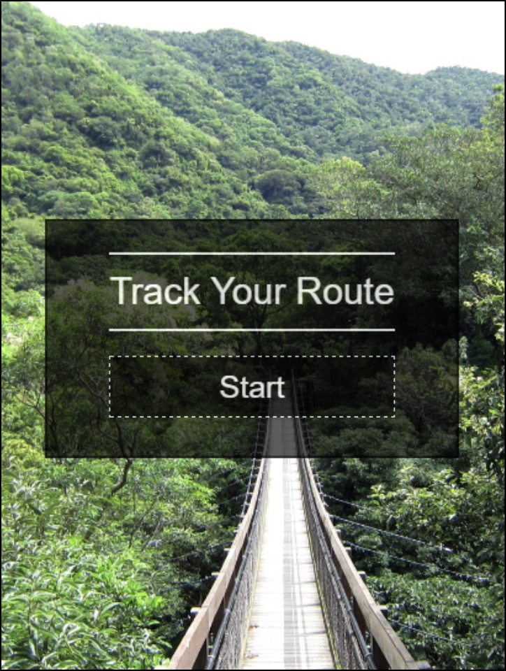
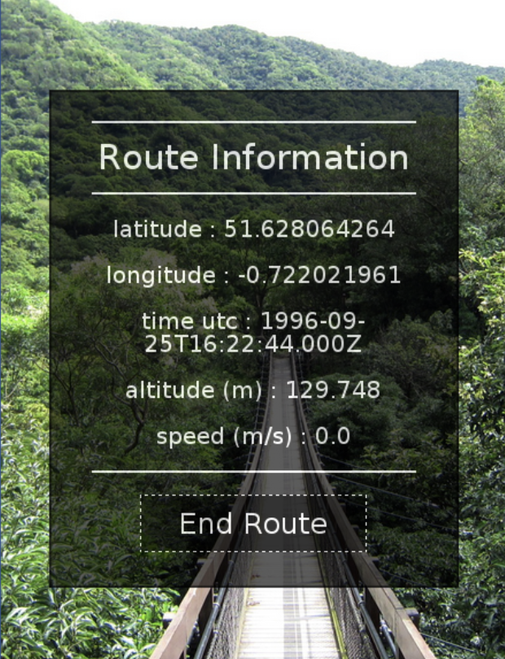
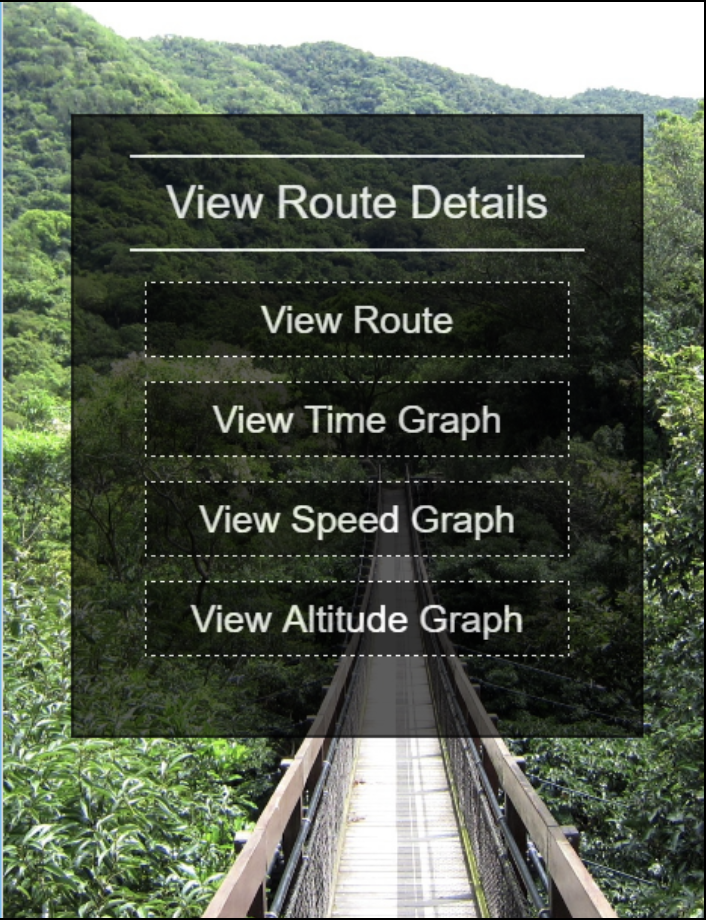
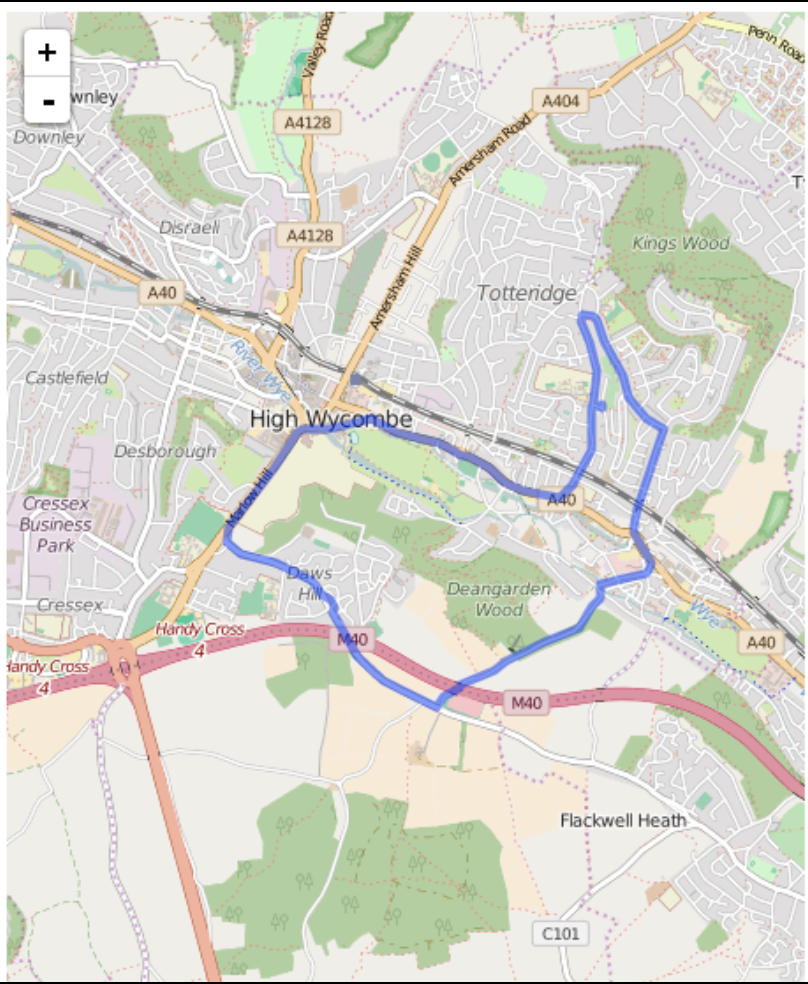
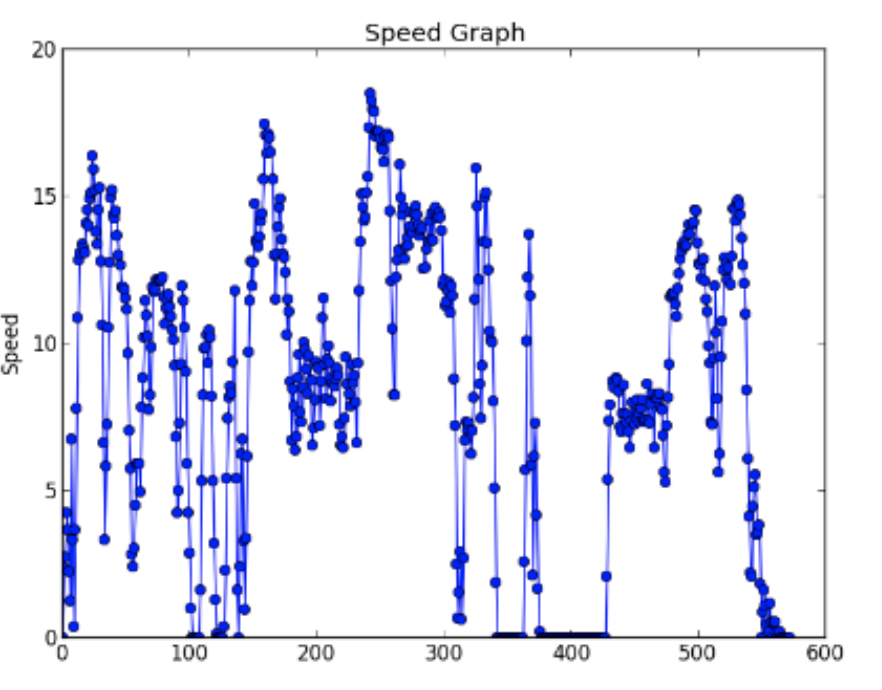
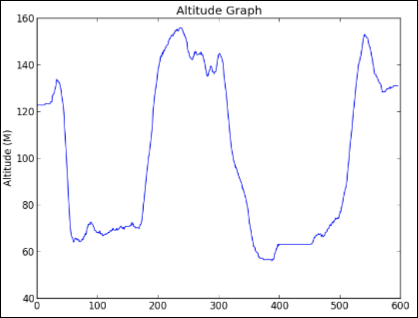

# Final Year Project

My final year project was based on utilising the Raspberry Pi and GPS.

The system captures, processes and displays the user's position, speed and altitude, on the Pi's server.

The user can connect to the Pi via Wi-Fi from a Wi-Fi enabled device, and then view the information within a web browser.

## Screenshots

### Start tracking your route

### Current tracking information

### Choose what graph to view

### See your route layered on a map

### Look at how your speed varied

### Look at how your altitude varied
